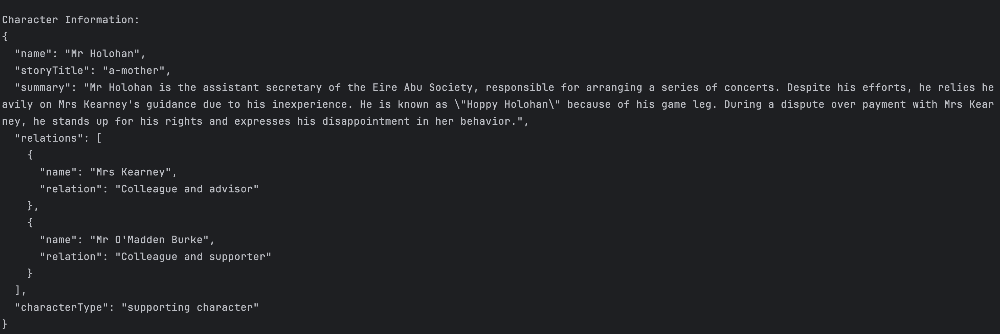
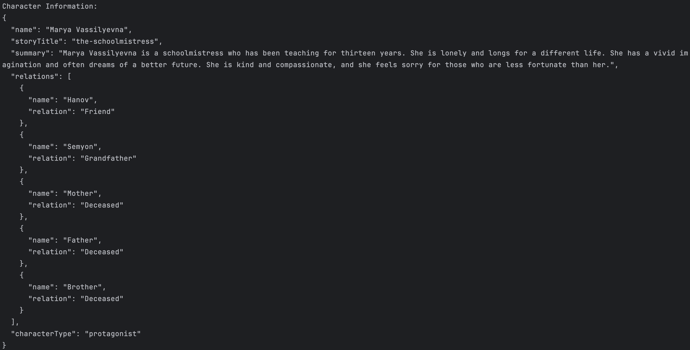
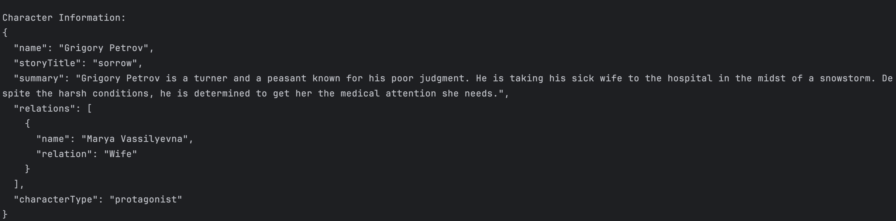

# Deepstack-Interview-problem
LangChain Assignment: Extracting Structured Information Objective Develop a script to extract structured details about characters from stories in a provided dataset and output the required details in JSON format. The goal is to transform unstructured narrative data into a structured format using embeddings and processing techniques.

# Character Information Extractor

A Python-based CLI tool that extracts structured information about characters from stories using LangChain and Google's Gemini AI. This project was developed as part of the LangChain Assignment to demonstrate the use of embeddings and Large Language Models for information extraction.

## Features

- Extract structured character information from story texts
- Vector database storage for efficient searching
- CLI interface for easy interaction
- Outputs character information in JSON format
- Uses Google's Gemini AI model for accurate information extraction

## Project Structure

```
character_extractor/
├── data/
│   └── chroma/          # Vector database storage
├── src/
│   ├── __init__.py
│   ├── database.py      # Vector store operations
│   ├── embeddings.py    # Embedding generation
│   └── character_info.py # Character information extraction
├── stories/             # Story text files
├── cli.py              # CLI interface
├── requirements.txt
└── .env                # Environment variables
```

## Installation

1. Clone the repository:
```bash
git clone (https://github.com/Ayu5-h/Deepstack-Interview-problem.git)
cd Deepstack-Interview-problem

```

2. Create a virtual environment:
```bash
python -m venv venv
source venv/bin/activate  # On Windows use: venv\Scripts\activate
```

3. Install dependencies:
```bash
pip install -r requirements.txt
```

4. Create a `.env` file and add your Google API key:
```
GOOGLE_API_KEY=your_api_key_here
```

> **Note**: You can obtain a Google API key from the [Google AI Studio](https://makersuite.google.com/app/apikey).

## Usage

### 1. Prepare Your Stories

Place your story files in the `stories` directory. Each file should:
- Be in `.txt` format
- Contain a single story
- Have a filename that represents the story title (e.g., `game_of_thrones.txt`)

### 2. Compute Embeddings

Process all stories and generate embeddings:
```bash
python cli.py compute-embeddings stories/
```

### 3. Extract Character Information

Get information about a specific character:
```bash
python cli.py get-character-info "Character Name"
```

### Sample Output

When extracting information about a character, you'll get a JSON response like this:

The output includes:
- Character name
- Story title
- Character summary
- Relations with other characters
- Character type/role

### Example Response

```json
{
    "name": "Jon Snow",
    "storyTitle": "Game of Thrones",
    "summary": "Jon Snow is a brave and honorable leader who serves as the Lord Commander of the Night's Watch and later unites the Free Folk and Westeros against the threat of the White Walkers.",
    "relations": [
        {"name": "Arya Stark", "relation": "Sister"},
        {"name": "Eddard Stark", "relation": "Father"}
    ],
    "characterType": "Protagonist"
}
```

### Additional Commands

Reset the vector database if needed:
```bash
python cli.py reset-database
```

## Example Story Files

Your story files should contain narrative text that includes character interactions and descriptions. 

## Example Output with different characters: 





## Technical Details

- Uses Google's Gemini Pro model for text generation
- Implements ChromaDB as the vector store
- Uses LangChain for workflow management
- Employs text chunking for efficient processing
- Implements error handling for edge cases

## Requirements

- Python 3.8+
- Google API key with access to Gemini AI
- Internet connection for API calls

## Error Handling

The tool handles various edge cases:
- Character not found in stories
- Invalid API key
- Malformed story files
- Connection issues


## License

This project is licensed under the MIT License - see the [LICENSE](LICENSE) file for details.
